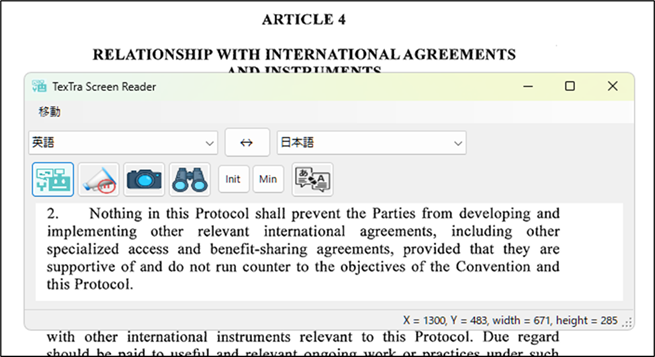

#  TexTra Screen Reader

**TexTra Screen Reader**は  
Windows上のテキストを翻訳、読み上げを行うアプリケーションです。 

**TexTra Screen Reader** is an application  
that  translates and reads aloud text on Windows.

---

🐤**X(Twitter)**  
  

---

📄**PDF**  
  

---

⚠️**エラーメッセージ** Error message 
 

---

🎮**ゲーム** Game 
 

※  特殊なフォントを使用している場合、文字の読み取りが失敗する場合があります。 
※ OCR、読上げ機能はWindowsのAPIを利用しています。 

\* If special fonts are used, text recognition may fail. 
\* The OCR and text-to-speech functions use Windows APIs. 

------

## 📥インストール Install

TexTra Screen Reader.msiを 
本画面の「Releases」からダウンロードして実行してください。 
https://github.com/NICT-Dev/TexTra-Screen-Reader/releases 

インストールが完了後、 
Windowsのメニューとデスクトップに 
アプリのアイコンが追加されます。 

ヘルプ 
https://nict-dev.github.io/TexTra-Screen-Reader/ja/メイン.html

................................................................................................................................................ 
Please download "TexTra Screen Reader.msi" 
from "Releases" section of this repository and run it. 
https://github.com/NICT-Dev/TexTra-Screen-Reader/releases 

After the installation is complete, 
the application icon will be added to the Windows Start menu and to the desktop. 

Help 
https://nict-dev.github.io/TexTra-Screen-Reader/en/メイン.html

------
##  みんなの自動翻訳 Min'na no Jido Hon'yaku

アプリ内では「みんなの自動翻訳」のアカウントが必要です。 
https://mt-auto-minhon-mlt.ucri.jgn-x.jp/

サーバーメンテナンスなどで 
一時的にご利用いただけないことがあります。 
サーバーメンテナンス情報などは下記をご確認ください。 
X(Twitter) 
https://twitter.com/minhonMT

................................................................................................................................................ 
A "Min'na no Jido Hon'yaku"  account to use the app. 
https://mt-auto-minhon-mlt.ucri.jgn-x.jp/

The service may be temporarily unavailable due to server maintenance.  
For server maintenance information, 
please check the details below. 
X(Twitter) 
https://twitter.com/minhonMT

------

## 💻 実行環境 System Requirements

64ビット版 Windows 10 または Windows 11 

Windows 10 (64‑bit) or Windows 11 (64‑bit) 

------
みんなの自動翻訳 - TexTra Screen Reader (古い内容が含まれています。) 
Min'na no Jido Hon'yaku - TexTra Screen Reader (The information on the linked page is outdated.) 
https://mt-auto-minhon-mlt.ucri.jgn-x.jp/content/tool/textrascreenreader/ 

        