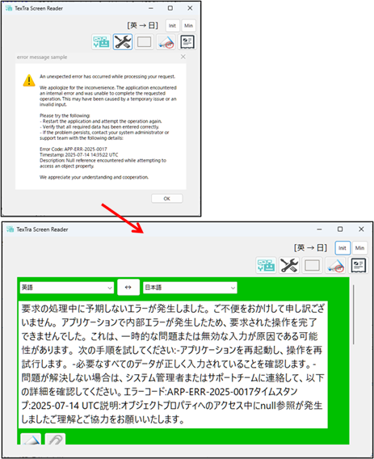
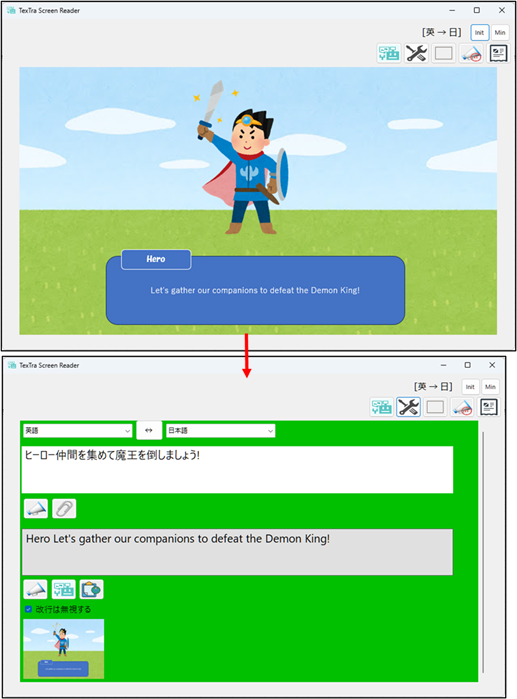

# TexTra Screen Reader

**TexTra Screen Reader**は  
Windows上のテキストを翻訳、読み上げを行うアプリケーションです。 

TexTra is an application that  translates and reads aloud text on Windows.

---

**X(Twitter)**  
  

---

**PDF**  
  

---

**エラーメッセージ** Error message 
 

---

**ゲーム** Game 
 

※  特殊なフォントを使用している場合、文字の読み取りが失敗する場合があります。 
※ OCR、読上げ機能はWindowsのAPIを利用しています。 

\* If special fonts are used, text recognition may fail. 
\* The OCR and text-to-speech functions use Windows APIs. 

------

## インストール Install

TexTra Screen Reader.msiを 
本画面の「Releases」からダウンロードして実行してください。 
https://github.com/NICT-Dev/TexTra-Screen-Reader/releases 

インストールが完了後、 
Windowsのメニューとデスクトップに 
アプリのアイコンが追加されます。 

Please download "TexTra Screen Reader.msi" 
from "Releases" section of this repository and run it. 
https://github.com/NICT-Dev/TexTra-Screen-Reader/releases 

After the installation is complete, 
the application icon will be added to the Windows Start menu and to the desktop. 

------

## 実行環境 System Requirements

64ビット版 Windows 10 または Windows 11 

Windows 10 (64‑bit) or Windows 11 (64‑bit) 